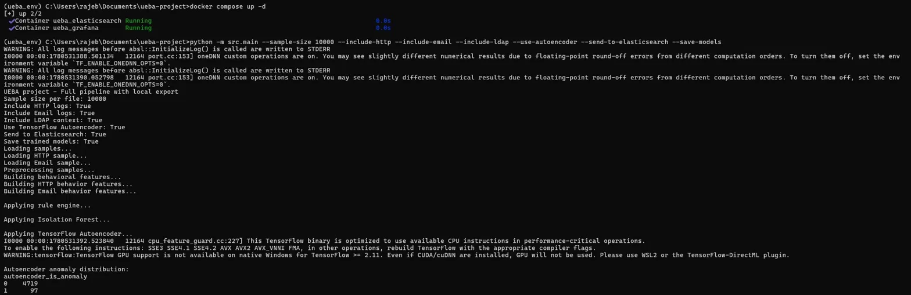
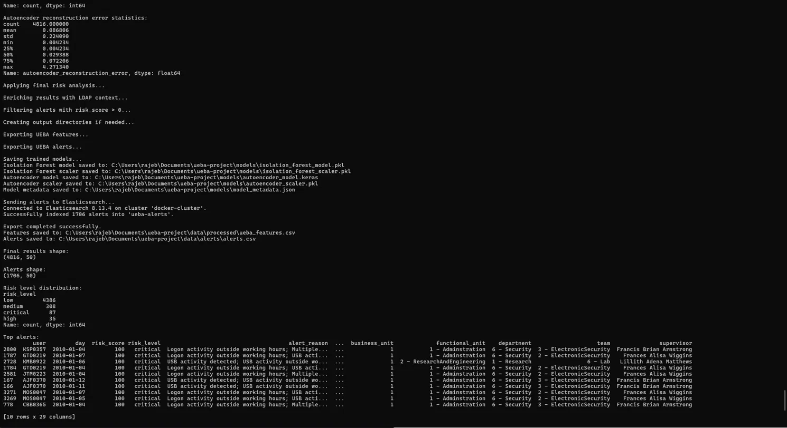

# Projet UEBA — Sécurité

> **User and Entity Behavior Analytics (UEBA)** — Dataset CERT Insider Threat r4.2
> **Stack :** Python · Scikit-learn · TensorFlow · Elasticsearch · Grafana · Docker

Ce projet implémente un pipeline UEBA complet, de l'ingestion des logs bruts jusqu'à la visualisation des alertes, la détection d'anomalies, la persistance des modèles et l'enrichissement contextuel.

---

## Structure du projet

```text
ueba-project/
│
├── data/
│   ├── raw/                         # Logs bruts CERT : logon, device, file, http, email, LDAP
│   ├── processed/                   # Variables comportementales traitées
│   └── alerts/                      # Alertes UEBA générées
│
├── Demonstration_Finale/
│   ├── Demo_1.png                   # Capture finale : pipeline complet et sauvegarde des modèles
│   └── Demo_2.png                   # Capture finale : Docker, Elasticsearch et sortie de commande
│
├── dashboards/
│   ├── grafana_dashboard.json       # Dashboard Grafana exporté
│   └── grafana_dashboard_notes.md   # Documentation du dashboard
│
├── models/
│   ├── isolation_forest_model.pkl   # Modèle Isolation Forest entraîné
│   ├── isolation_forest_scaler.pkl  # Scaler utilisé pour Isolation Forest
│   ├── autoencoder_model.keras      # Modèle TensorFlow Autoencoder entraîné
│   ├── autoencoder_scaler.pkl       # Scaler utilisé pour l'Autoencoder
│   └── model_metadata.json          # Métadonnées sur les modèles sauvegardés
│
├── notebooks/
│   └── 01_ueba_results_analysis.ipynb
│
├── reports/
│   ├── figures/                     # Figures générées pour le rapport analytique
│   ├── tables/                      # Tableaux statistiques optionnels
│   └── rapport_analytique.md        # Rapport analytique du projet
│
├── src/
│   ├── config.py                    # Configuration centrale et chemins
│   ├── load_data.py                 # Chargement sécurisé des fichiers CSV
│   ├── preprocessing.py             # Analyse des dates et variables temporelles
│   ├── feature_engineering.py       # Construction des variables comportementales
│   ├── rule_engine.py               # Scoring de risque par règles
│   ├── isolation_forest_model.py    # Détection d'anomalies par Isolation Forest
│   ├── autoencoder_model.py         # Détection d'anomalies par TensorFlow Autoencoder
│   ├── risk_analyzer.py             # Calcul du score de risque final
│   ├── context_enrichment.py        # Enrichissement contextuel LDAP
│   ├── elastic_connector.py         # Indexation dans Elasticsearch
│   └── main.py                      # Point d'entrée du pipeline
│
├── docker-compose.yml               # Services Elasticsearch et Grafana
├── environment.yml                  # Définition de l'environnement Conda
├── requirements.txt                 # Dépendances Python
├── .gitignore                       # Fichiers exclus de Git
└── README.md                        # Documentation du projet
```

---

## Vue d'ensemble du pipeline

```
Logs CERT r4.2
      ↓
Prétraitement
      ↓
Feature Engineering (logon · device · file · http · email)
      ↓
Moteur de règles
      ↓
Isolation Forest
      ↓
TensorFlow Autoencoder
      ↓
Analyseur de risque
      ↓
Enrichissement LDAP
      ↓
Export CSV
      ↓
Sauvegarde des modèles
      ↓
Elasticsearch
      ↓
Dashboard Grafana
```

---

## Fonctionnalités

### 1. Construction des variables comportementales

Les variables sont agrégées par `utilisateur + jour` à partir de cinq sources de logs.

| Source       | Variables extraites                                                                        |
|--------------|--------------------------------------------------------------------------------------------|
| `logon.csv`  | Connexions/déconnexions, activité hors horaires, postes uniques                            |
| `device.csv` | Connexions/déconnexions USB, activité hors horaires, postes uniques                        |
| `file.csv`   | Copies de fichiers, copies hors horaires, fichiers et postes uniques                       |
| `http.csv`   | Événements HTTP, activité hors horaires, URLs uniques, domaines et postes uniques          |
| `email.csv`  | Volume d'emails, pièces jointes, usage BCC, activité hors horaires et taille des emails    |

### 2. Scoring de risque par règles

Le moteur de règles génère un `rule_score` préliminaire basé sur des règles métier couvrant :

- activité hors horaires de travail ;
- utilisation de périphériques USB ;
- activité USB hors horaires de travail ;
- volume élevé de copies de fichiers ;
- copies de fichiers hors horaires de travail ;
- utilisation de plusieurs postes ;
- combinaisons comportementales dangereuses.

Le moteur produit également `rule_reasons`, rendant la détection explicable.

### 3. Détection d'anomalies

| Modèle                 | Approche                                                                                   |
|------------------------|--------------------------------------------------------------------------------------------|
| Isolation Forest       | Détection d'anomalies non supervisée avec `contamination=0.02`                             |
| TensorFlow Autoencoder | Détection par erreur de reconstruction avec seuil au percentile 98                         |

La couche de détection d'anomalies ajoute les champs suivants :

| Champ                              | Description                                              |
|------------------------------------|----------------------------------------------------------|
| `is_anomaly`                       | Indicateur d'anomalie Isolation Forest                   |
| `anomaly_score`                    | Score d'anomalie Isolation Forest                        |
| `autoencoder_is_anomaly`           | Indicateur d'anomalie TensorFlow Autoencoder             |
| `autoencoder_reconstruction_error` | Erreur de reconstruction de l'Autoencoder                |
| `autoencoder_threshold`            | Seuil utilisé pour la détection par l'Autoencoder        |

### 4. Enrichissement contextuel LDAP

Les snapshots LDAP sont utilisés pour enrichir les alertes avec le contexte organisationnel.

Les champs ajoutés sont : `employee_name`, `role`, `position`, `business_unit`, `functional_unit`, `department`, `team`, `supervisor`, `ldap_source_file`.

Le LDAP n'est pas utilisé directement dans le calcul du score de risque. Il permet à l'analyste de comprendre le contexte organisationnel de chaque alerte.

### 5. Analyse de risque finale

L'analyseur de risque final combine :

- le score issu du moteur de règles ;
- la détection d'anomalies par Isolation Forest ;
- la détection d'anomalies par TensorFlow Autoencoder.

Il produit :

| Sortie         | Description                                  |
|----------------|----------------------------------------------|
| `risk_score`   | Score final de 0 à 100                       |
| `risk_level`   | `low`, `medium`, `high` ou `critical`        |
| `alert_reason` | Explication lisible de l'alerte              |

Seuils des niveaux de risque :

| Score      | Niveau     |
|------------|------------|
| 0 à 30     | `low`      |
| 31 à 60    | `medium`   |
| 61 à 80    | `high`     |
| 81 à 100   | `critical` |

---

## Exécution du pipeline

```bash
# Activer l'environnement
conda activate ueba_env

# Pipeline complet avec toutes les fonctionnalités
python -m src.main ^
  --sample-size 10000 ^
  --include-http ^
  --include-email ^
  --include-ldap ^
  --use-autoencoder ^
  --send-to-elasticsearch
```

Sous Windows cmd, le symbole `^` permet de continuer une commande sur la ligne suivante.

Version sur une seule ligne :

```bash
python -m src.main --sample-size 10000 --include-http --include-email --include-ldap --use-autoencoder --send-to-elasticsearch
```

---

## Sauvegarde des modèles entraînés

Le pipeline peut sauvegarder les artefacts des modèles entraînés dans le dossier `models/`.

```bash
python -m src.main --sample-size 10000 --include-http --include-email --include-ldap --use-autoencoder --save-models
```

Cette commande génère :

```
models/isolation_forest_model.pkl
models/isolation_forest_scaler.pkl
models/autoencoder_model.keras
models/autoencoder_scaler.pkl
models/model_metadata.json
```

Le fichier de métadonnées contient les informations suivantes :

- taille de l'échantillon ;
- fonctionnalités activées ;
- dimensions des sorties ;
- distribution des niveaux de risque ;
- contamination d'Isolation Forest ;
- paramètres de l'Autoencoder ;
- chemins des modèles sauvegardés.

---

## Options de ligne de commande

| Option                    | Description                                                   |
|---------------------------|---------------------------------------------------------------|
| `--sample-size N`         | Nombre de lignes par fichier de logs à traiter                |
| `--include-http`          | Inclure les variables issues des logs HTTP                    |
| `--include-email`         | Inclure les variables issues des logs email                   |
| `--include-ldap`          | Activer l'enrichissement contextuel LDAP                      |
| `--use-autoencoder`       | Appliquer la détection d'anomalies par TensorFlow Autoencoder |
| `--send-to-elasticsearch` | Envoyer les alertes générées vers Elasticsearch               |
| `--save-models`           | Sauvegarder les modèles et scalers dans `models/`             |

---

## Fichiers de sortie

Le pipeline génère deux fichiers CSV principaux :

```
data/processed/ueba_features.csv   →  Tous les comportements utilisateur/jour analysés
data/alerts/alerts.csv             →  Alertes avec risk_score > 0
```

Si `--save-models` est utilisé, les artefacts des modèles sont sauvegardés dans :

```
models/
```

---

## Elasticsearch et Grafana

Démarrer Elasticsearch et Grafana avec Docker Compose :

```bash
docker compose up -d
```

Elasticsearch est accessible localement à :

```
http://localhost:9200
```

Grafana est accessible à :

```
http://localhost:3000
```

Le pipeline indexe les alertes dans l'index `ueba-alerts`.

Pour vérifier les alertes indexées :

```bash
curl http://localhost:9200/ueba-alerts/_count
```

---

## Dashboard Grafana

Le dashboard propose **9 panels** pour superviser les alertes UEBA.

| Panel                            | Description                                           |
|----------------------------------|-------------------------------------------------------|
| Total Alerts                     | Nombre total d'alertes indexées                       |
| Critical Alerts                  | Alertes classifiées comme critiques                   |
| Alerts by Risk Level             | Distribution des alertes par niveau de risque         |
| Top Risky Users                  | Utilisateurs générant le plus d'alertes               |
| Recent Alerts                    | Table détaillée des alertes triées par score de risque|
| Alerts by Department             | Alertes regroupées par département LDAP               |
| Top Supervisors by Alerts        | Alertes regroupées par superviseur                    |
| TensorFlow Autoencoder Anomalies | Anomalies détectées par l'Autoencoder                 |
| Alerts with Email Activity       | Alertes contenant une activité email                  |


Le dashboard est exporté dans :

```
dashboards/grafana_dashboard.json
```

---

## Résultats — Exemple d'exécution

Exécution avec :

```bash
python -m src.main --sample-size 10000 --include-http --include-email --include-ldap --use-autoencoder --send-to-elasticsearch
```

| Métrique                                    | Valeur |
|---------------------------------------------|-------:|
| Comportements analysés (utilisateur/jour)   |  4 816 |
| Alertes générées                            |  1 704 |
| Alertes critiques                           |     93 |
| Alertes avec activité email                 |    366 |
| Anomalies TensorFlow Autoencoder            |     97 |
| Colonnes de variables finales               |     50 |

Distribution par niveau de risque :

| Niveau     | Nombre |
|------------|-------:|
| `low`      |  4 388 |
| `medium`   |    307 |
| `high`     |     28 |
| `critical` |     93 |

---

## Notebook d'analyse

Un notebook Jupyter a été ajouté en complément du rapport analytique :

```text
notebooks/01_ueba_results_analysis.ipynb
```

Ce notebook analyse les sorties générées par le pipeline UEBA :

```text
data/processed/ueba_features.csv
data/alerts/alerts.csv
```

Il fournit plusieurs formats d'analyse complémentaires :

- aperçu des données ;
- tableaux de statistiques globales ;
- statistiques descriptives sur les scores de risque ;
- distribution des niveaux de risque ;
- utilisateurs les plus risqués ;
- analyse des anomalies Isolation Forest ;
- analyse des anomalies TensorFlow Autoencoder ;
- alertes par département LDAP ;
- alertes par superviseur ;
- analyse des activités email et HTTP ;
- échantillons des alertes les plus critiques.

Les figures générées sont sauvegardées dans :

```text
reports/figures/
```

Figures générées :

```text
risk_level_distribution.png
top_risky_users.png
autoencoder_anomalies.png
alerts_by_department.png
alerts_by_supervisor.png
alerts_email_http_activity.png
```

Ces figures enrichissent le rapport analytique et constituent des preuves visuelles statiques en complément du dashboard Grafana.

Le notebook exporte également des tableaux statistiques au format `.csv` dans :

```text
reports/tables/
```

---

## Artefacts des modèles entraînés

Les modèles entraînés actuellement versionnés dans le projet sont :

| Fichier                              | Description                                        |
|--------------------------------------|----------------------------------------------------|
| `models/isolation_forest_model.pkl`  | Modèle Isolation Forest entraîné                   |
| `models/isolation_forest_scaler.pkl` | Scaler utilisé avant Isolation Forest              |
| `models/autoencoder_model.keras`     | TensorFlow Autoencoder entraîné                    |
| `models/autoencoder_scaler.pkl`      | Scaler utilisé avant l'Autoencoder                 |
| `models/model_metadata.json`         | Métadonnées décrivant l'exécution d'entraînement   |

Ces artefacts permettent de conserver un snapshot reproductible des modèles entraînés.

---

## Démonstration finale

Les résultats suivants ont été obtenus lors de l'exécution finale complète du pipeline, avec toutes les fonctionnalités activées, y compris la sauvegarde des modèles et l'indexation Elasticsearch.

**Commande utilisée :**

```bash
python -m src.main --sample-size 10000 --include-http --include-email --include-ldap --use-autoencoder --send-to-elasticsearch --save-models
```

### Infrastructure

Les deux containers Docker ont démarré avec succès avant l'exécution :

```
[+] up 2/2
✔ Container ueba_elasticsearch   Running
✔ Container ueba_grafana         Running
```

### Exécution du pipeline

Le pipeline a exécuté toutes les étapes en séquence :

```
Loading samples...
Loading HTTP sample...
Loading Email sample...
Preprocessing samples...
Building behavioral features...
Building HTTP behavior features...
Building Email behavior features...
Applying rule engine...
Applying Isolation Forest...
Applying TensorFlow Autoencoder...
Applying final risk analysis...
Enriching results with LDAP context...
Filtering alerts with risk_score > 0...
Exporting UEBA features...
Exporting UEBA alerts...
Saving trained models...
Sending alerts to Elasticsearch...
```

### TensorFlow Autoencoder — distribution des anomalies

| `autoencoder_is_anomaly` | Nombre |
|--------------------------|-------:|
| 0 — Normal               |  4 719 |
| 1 — Anomalie             |     97 |

### TensorFlow Autoencoder — statistiques de l'erreur de reconstruction

| Statistique | Valeur    |
|-------------|----------:|
| count       | 4 816     |
| mean        | 0.086806  |
| std         | 0.224090  |
| min         | 0.004234  |
| 25%         | 0.004234  |
| 50%         | 0.029388  |
| 75%         | 0.072206  |
| max         | 4.271340  |

### Modèles sauvegardés

```
models/isolation_forest_model.pkl    ✔
models/isolation_forest_scaler.pkl   ✔
models/autoencoder_model.keras       ✔
models/autoencoder_scaler.pkl        ✔
models/model_metadata.json           ✔
```

### Indexation Elasticsearch

```
Connecté à Elasticsearch 8.13.4 sur le cluster 'docker-cluster'.
1706 alertes indexées avec succès dans 'ueba-alerts'.
```

### Dimensions des fichiers de sortie

| Fichier               | Dimensions |
|-----------------------|------------|
| `ueba_features.csv`   | 4816 × 50  |
| `alerts.csv`          | 1706 × 50  |

### Distribution finale des niveaux de risque

| Niveau     | Nombre |
|------------|-------:|
| `low`      |  4 386 |
| `medium`   |    308 |
| `critical` |     87 |
| `high`     |     35 |

### Échantillon des alertes critiques (risk_score = 100)

| Utilisateur | Date       | Score | Niveau   | Département      | Superviseur             |
|-------------|------------|:-----:|----------|------------------|-------------------------|
| KSP0357     | 2010-01-04 | 100   | critical | 6 – Security     | Francis Brian Armstrong |
| GTD0219     | 2010-01-07 | 100   | critical | 6 – Security     | Frances Alisa Wiggins   |
| WMB0022     | 2010-01-06 | 100   | critical | 1 – Research     | Lillith Adena Matthews  |
| GTD0219     | 2010-01-04 | 100   | critical | 6 – Security     | Frances Alisa Wiggins   |
| JTM0223     | 2010-01-04 | 100   | critical | 6 – Security     | Frances Alisa Wiggins   |
| AJF0370     | 2010-01-12 | 100   | critical | 6 – Security     | Francis Brian Armstrong |
| AJF0370     | 2010-01-11 | 100   | critical | 6 – Security     | Francis Brian Armstrong |
| MOS0047     | 2010-01-07 | 100   | critical | 6 – Security     | Frances Alisa Wiggins   |
| MOS0047     | 2010-01-05 | 100   | critical | 6 – Security     | Frances Alisa Wiggins   |
| CBB0365     | 2010-01-04 | 100   | critical | 6 – Security     | Francis Brian Armstrong |

Les alertes les plus critiques sont concentrées dans le **département Sécurité**, avec des raisons d'alerte combinant activité de connexion hors horaires, usage USB et plusieurs signaux comportementaux déclenchant le score de risque maximal.

### Captures d'écran

**Démo 1 — Exécution du pipeline et sortie de l'Autoencoder**



**Démo 2 — Analyse de risque, sauvegarde des modèles, indexation Elasticsearch et alertes critiques**



---

## Statut du projet

- [x] Pipeline fonctionnel pour logon, device, file, HTTP et email
- [x] Isolation Forest intégré
- [x] TensorFlow Autoencoder intégré
- [x] Enrichissement contextuel LDAP ajouté
- [x] Indexation Elasticsearch connectée
- [x] Dashboard Grafana créé et exporté
- [x] Capture du dashboard ajoutée au rapport analytique
- [x] Artefacts des modèles entraînés sauvegardés dans `models/`
- [x] Notebook d'analyse ajouté avec figures et tableaux statistiques
- [x] Exécution finale de démonstration complétée et documentée
- [x] Projet versionné sur GitHub étape par étape

---

*Projet UEBA — EMSI 4CIR Anfa*