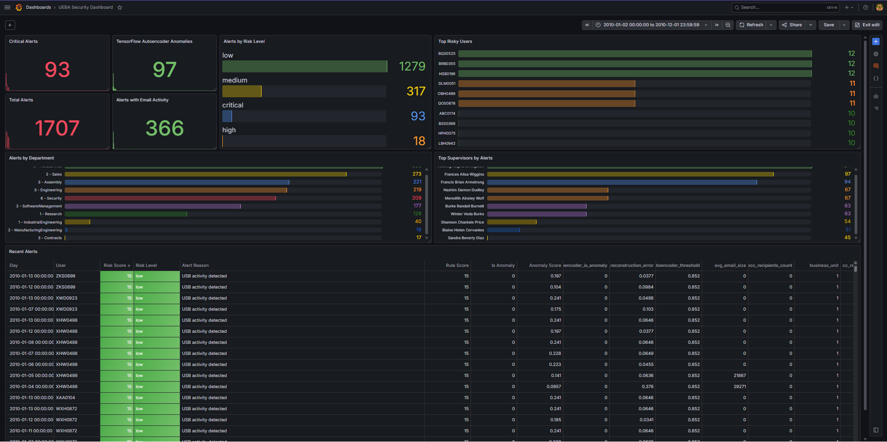

# UEBA Security Project

> **User and Entity Behavior Analytics (UEBA)** — CERT Insider Threat Dataset r4.2
> **Stack :** Python · Scikit-learn · TensorFlow · Elasticsearch · Grafana · Docker

This project implements a full UEBA pipeline, from raw log ingestion to alert visualization, anomaly detection, model persistence, and context enrichment.

---

## Project Structure

```
ueba-project/
│
├── data/
│   ├── raw/                        # Raw CERT logs : logon, device, file, http, email, LDAP
│   ├── processed/                  # Processed UEBA features
│   └── alerts/                     # Generated UEBA alerts
│
├── dashboards/
│   └── grafana_dashboard.json      # Exported Grafana dashboard
│
├── models/
│   ├── isolation_forest_model.pkl  # Trained Isolation Forest model
│   ├── isolation_forest_scaler.pkl # Scaler used for Isolation Forest
│   ├── autoencoder_model.keras     # Trained TensorFlow Autoencoder model
│   ├── autoencoder_scaler.pkl      # Scaler used for Autoencoder
│   └── model_metadata.json         # Metadata about the saved models
│
├── reports/
│   ├── rapport_analytique.md       # Project analytical report
│   └── figures/
│       └── Dashboard.png           # Grafana dashboard screenshot
│
├── src/
│   ├── config.py                   # Central configuration and paths
│   ├── load_data.py                # Secure CSV file loading
│   ├── preprocessing.py            # Date parsing and temporal features
│   ├── feature_engineering.py      # Logon, device, file, HTTP, email features
│   ├── rule_engine.py              # Rule-based risk scoring
│   ├── isolation_forest_model.py   # Isolation Forest anomaly detection
│   ├── autoencoder_model.py        # TensorFlow Autoencoder anomaly detection
│   ├── risk_analyzer.py            # Final risk score computation
│   ├── context_enrichment.py       # LDAP context enrichment
│   ├── elastic_connector.py        # Elasticsearch indexing
│   └── main.py                     # Pipeline entry point
│
└── README.md
```

---

## Pipeline Overview

```
Logs CERT r4.2
      ↓
Preprocessing
      ↓
Feature Engineering (logon · device · file · http · email)
      ↓
Rule Engine
      ↓
Isolation Forest
      ↓
TensorFlow Autoencoder
      ↓
Risk Analyzer
      ↓
LDAP Context Enrichment
      ↓
Export CSV
      ↓
Model Saving
      ↓
Elasticsearch
      ↓
Grafana Dashboard
```

---

## Features

### 1. Behavioral Feature Engineering

Features are aggregated per `user + day` from five log sources.

| Source       | Features extracted                                                                |
|--------------|-----------------------------------------------------------------------------------|
| `logon.csv`  | Logon/logoff events, outside-hours activity, unique PCs                           |
| `device.csv` | USB connect/disconnect events, outside-hours activity, unique PCs                 |
| `file.csv`   | File copy events, outside-hours copies, unique files and PCs                      |
| `http.csv`   | HTTP events, outside-hours activity, unique URLs, unique domains and PCs          |
| `email.csv`  | Email volume, attachments, BCC usage, outside-hours activity and email size       |

### 2. Rule-Based Risk Scoring

The rule engine generates a preliminary `rule_score` based on domain rules covering:

- outside-hours activity;
- USB usage;
- USB activity outside working hours;
- high file-copy volume;
- file-copy activity outside working hours;
- multi-PC usage;
- dangerous behavioral combinations.

The rule engine also produces `rule_reasons`, making the detection explainable.

### 3. Anomaly Detection

| Model                  | Approach                                                                          |
|------------------------|-----------------------------------------------------------------------------------|
| Isolation Forest       | Unsupervised anomaly detection with `contamination=0.02`                          |
| TensorFlow Autoencoder | Reconstruction-error anomaly detection using the 98th percentile threshold        |

The anomaly detection layer adds the following fields:

| Field                              | Description                                     |
|------------------------------------|-------------------------------------------------|
| `is_anomaly`                       | Isolation Forest anomaly flag                   |
| `anomaly_score`                    | Isolation Forest anomaly score                  |
| `autoencoder_is_anomaly`           | TensorFlow Autoencoder anomaly flag             |
| `autoencoder_reconstruction_error` | Reconstruction error from the Autoencoder       |
| `autoencoder_threshold`            | Threshold used for Autoencoder anomaly detection|

### 4. LDAP Context Enrichment

LDAP snapshots are used to enrich alerts with organizational context.

Added fields include: `employee_name`, `role`, `position`, `business_unit`, `functional_unit`, `department`, `team`, `supervisor`, `ldap_source_file`.

LDAP is not used directly to calculate the risk score. It is used to help analysts understand the organizational context of each alert.

### 5. Final Risk Analysis

The final risk analyzer combines:

- rule-based score;
- Isolation Forest anomaly detection;
- TensorFlow Autoencoder anomaly detection.

It produces:

| Output         | Description                             |
|----------------|-----------------------------------------|
| `risk_score`   | Final score from 0 to 100               |
| `risk_level`   | `low`, `medium`, `high`, or `critical`  |
| `alert_reason` | Human-readable explanation              |

Risk level thresholds:

| Score      | Level      |
|------------|------------|
| 0 to 30    | `low`      |
| 31 to 60   | `medium`   |
| 61 to 80   | `high`     |
| 81 to 100  | `critical` |

---

## Running the Pipeline

```bash
# Activate your environment
conda activate ueba_env

# Full pipeline with all features
python -m src.main ^
  --sample-size 10000 ^
  --include-http ^
  --include-email ^
  --include-ldap ^
  --use-autoencoder ^
  --send-to-elasticsearch
```

On Windows cmd, the `^` symbol allows a command to continue on the next line.

You can also run it in one line:

```bash
python -m src.main --sample-size 10000 --include-http --include-email --include-ldap --use-autoencoder --send-to-elasticsearch
```

---

## Saving Trained Models

The pipeline can save trained model artifacts in the `models/` directory.

```bash
python -m src.main --sample-size 10000 --include-http --include-email --include-ldap --use-autoencoder --save-models
```

This generates:

```
models/isolation_forest_model.pkl
models/isolation_forest_scaler.pkl
models/autoencoder_model.keras
models/autoencoder_scaler.pkl
models/model_metadata.json
```

The metadata file contains information about:

- sample size;
- enabled features;
- output shapes;
- risk-level distribution;
- Isolation Forest contamination;
- Autoencoder parameters;
- saved model paths.

---

## Command-Line Options

| Flag                      | Description                                          |
|---------------------------|------------------------------------------------------|
| `--sample-size N`         | Number of rows per raw log file to process           |
| `--include-http`          | Include HTTP log features                            |
| `--include-email`         | Include email log features                           |
| `--include-ldap`          | Enable LDAP context enrichment                       |
| `--use-autoencoder`       | Apply TensorFlow Autoencoder anomaly detection       |
| `--send-to-elasticsearch` | Push generated alerts to Elasticsearch               |
| `--save-models`           | Save trained models and scalers in `models/`         |

---

## Output Files

The pipeline generates two main CSV outputs:

```
data/processed/ueba_features.csv   →  All analyzed user/day behaviors
data/alerts/alerts.csv             →  Alerts with risk_score > 0
```

If `--save-models` is used, trained model artifacts are saved in:

```
models/
```

---

## Elasticsearch and Grafana

Start Elasticsearch and Grafana using Docker Compose:

```bash
docker compose up -d
```

Elasticsearch is available locally at:

```
http://localhost:9200
```

Grafana is available at:

```
http://localhost:3000
```

The pipeline indexes alerts into the `ueba-alerts` index.

You can verify the indexed alerts with:

```bash
curl http://localhost:9200/ueba-alerts/_count
```

---

## Grafana Dashboard

The dashboard provides **9 panels** to monitor UEBA alerts.

| Panel                            | Description                                      |
|----------------------------------|--------------------------------------------------|
| Total Alerts                     | Total number of indexed alerts                   |
| Critical Alerts                  | Alerts classified as critical                    |
| Alerts by Risk Level             | Distribution of alerts by risk level             |
| Top Risky Users                  | Users generating the most alerts                 |
| Recent Alerts                    | Detailed alert table sorted by risk score        |
| Alerts by Department             | Alerts grouped by LDAP department                |
| Top Supervisors by Alerts        | Alerts grouped by supervisor                     |
| TensorFlow Autoencoder Anomalies | Anomalies detected by the Autoencoder            |
| Alerts with Email Activity       | Alerts containing email activity                 |



The dashboard is exported as:

```
dashboards/grafana_dashboard.json
```

---

## Results — Sample Run

Sample run with:

```bash
python -m src.main --sample-size 10000 --include-http --include-email --include-ldap --use-autoencoder --send-to-elasticsearch
```

| Metric                           | Value  |
|----------------------------------|-------:|
| Behaviors analyzed (user/day)    |  4,816 |
| Total alerts generated           |  1,704 |
| Critical alerts                  |     93 |
| Alerts with email activity       |    366 |
| TensorFlow Autoencoder anomalies |     97 |
| Final feature columns            |     50 |

Risk-level distribution:

| Level      | Count  |
|------------|-------:|
| `low`      |  4,388 |
| `medium`   |    307 |
| `high`     |     28 |
| `critical` |     93 |

---

## Trained Model Artifacts

The trained models currently versioned in the project are:

| File                               | Description                              |
|------------------------------------|------------------------------------------|
| `models/isolation_forest_model.pkl`  | Trained Isolation Forest model           |
| `models/isolation_forest_scaler.pkl` | Scaler used before Isolation Forest      |
| `models/autoencoder_model.keras`     | Trained TensorFlow Autoencoder           |
| `models/autoencoder_scaler.pkl`      | Scaler used before Autoencoder           |
| `models/model_metadata.json`         | Metadata describing the saved training run |

These artifacts allow the project to keep a reproducible trained-model snapshot.

---

## Status

- [x] Pipeline functional for logon, device, file, HTTP, and email features
- [x] Isolation Forest integrated
- [x] TensorFlow Autoencoder integrated
- [x] LDAP context enrichment added
- [x] Elasticsearch indexing connected
- [x] Grafana dashboard created and exported
- [x] Dashboard screenshot added to the analytical report
- [x] Trained model artifacts saved in `models/`
- [x] Project versioned on GitHub step by step

---

*Projet UEBA — EMSI 4CIR Anfa*