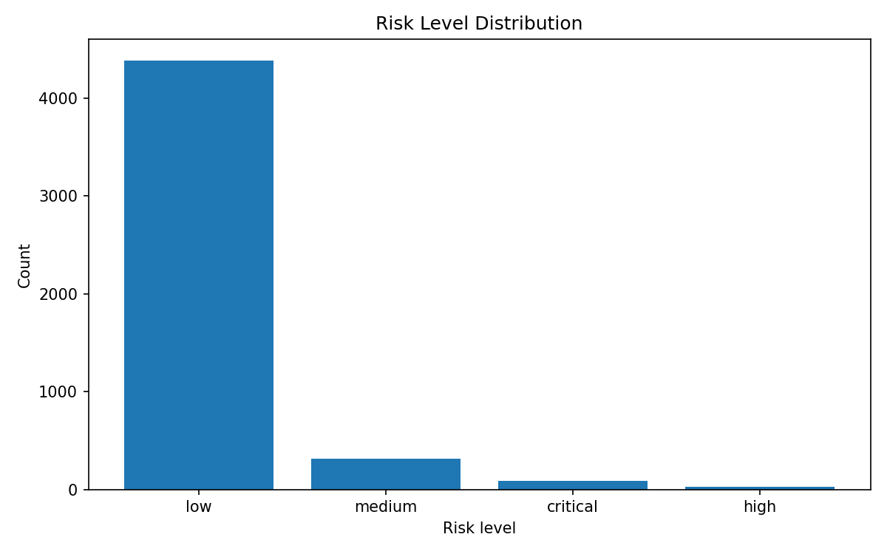
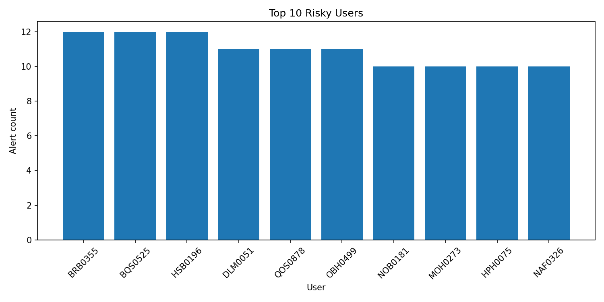
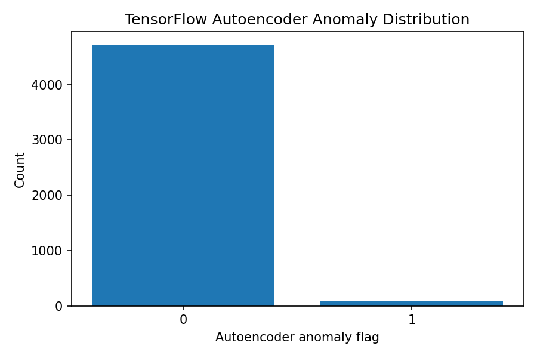
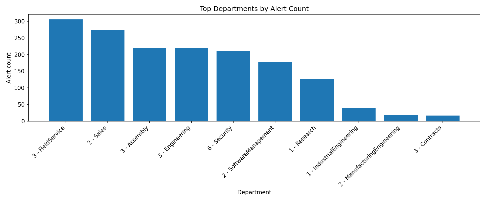
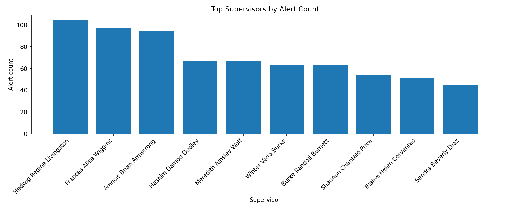
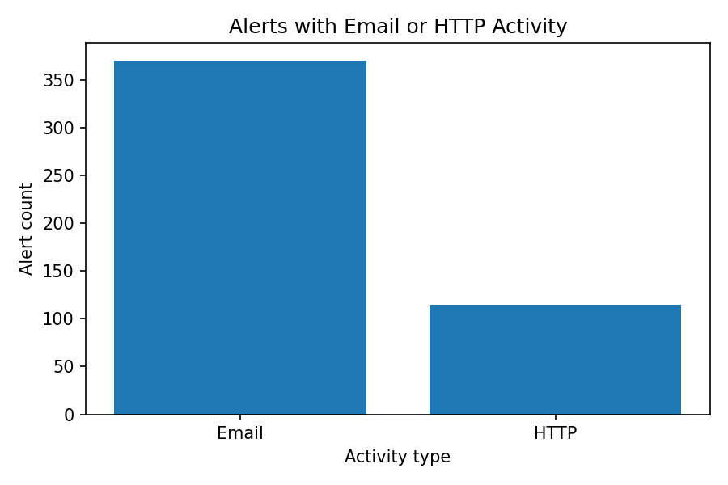

# Rapport Analytique — Projet UEBA

> **Plateforme :** User and Entity Behavior Analytics
> **Dataset :** CERT Insider Threat r4.2
> **Stack :** Python · Scikit-learn · TensorFlow · Elasticsearch · Grafana · Docker

---

## 1. Introduction

Ce projet consiste à développer une plateforme **UEBA** (*User and Entity Behavior Analytics*) destinée à détecter des comportements suspects à partir de logs utilisateurs et systèmes.

L'objectif principal est d'identifier des signaux pouvant révéler une menace interne, un compte compromis, une activité anormale ou une tentative d'exfiltration de données.

Contrairement à une détection classique basée uniquement sur des signatures connues, l'approche UEBA repose sur l'analyse du comportement des utilisateurs et des entités. Le système cherche à comprendre ce qui est habituel, puis à faire ressortir les comportements qui s'éloignent de cette normalité.

Dans ce projet, la plateforme analyse les logs du dataset **CERT r4.2**, construit des indicateurs comportementaux, applique un moteur de règles, utilise deux modèles d'intelligence artificielle, puis génère des alertes consultables dans **Elasticsearch** et **Grafana**.

Les modèles IA utilisés sont :

- **Isolation Forest** — détection d'anomalies non supervisée
- **TensorFlow Autoencoder** — détection avancée basée sur l'erreur de reconstruction

---

## 2. Objectifs du projet

Les objectifs principaux du projet sont les suivants :

- Collecter et analyser des logs issus du dataset CERT r4.2
- Transformer les logs bruts en variables comportementales exploitables
- Détecter des comportements suspects liés aux connexions, aux périphériques USB et aux copies de fichiers
- Intégrer l'activité web issue de `http.csv`
- Intégrer l'activité email issue de `email.csv`
- Enrichir les alertes avec le contexte organisationnel LDAP
- Construire un moteur de règles explicable
- Intégrer un modèle **Isolation Forest**
- Intégrer un modèle **TensorFlow Autoencoder**
- Produire un score de risque final
- Exporter les alertes localement au format CSV
- Indexer les alertes dans Elasticsearch
- Visualiser les résultats dans un dashboard Grafana

Le projet répond aux trois livrables attendus : un moteur UEBA, un dashboard de supervision et un rapport analytique.

---

## 3. Dataset utilisé

Le projet utilise le dataset **CERT Insider Threat r4.2**, qui simule l'activité d'utilisateurs dans une organisation.

| Fichier              | Contenu                                    | Utilisation                  |
|----------------------|--------------------------------------------|------------------------------|
| `logon.csv`          | Connexions et déconnexions                 | Utilisé                      |
| `device.csv`         | Événements USB                             | Utilisé                      |
| `file.csv`           | Copies de fichiers vers supports amovibles | Utilisé                      |
| `http.csv`           | Navigation web                             | Utilisé                      |
| `email.csv`          | Activité email                             | Utilisé                      |
| `LDAP/`              | Informations organisationnelles            | Utilisé pour enrichissement  |
| `psychometric.csv`   | Scores psychométriques Big Five            | Non utilisé dans le scoring  |

> Le fichier `psychometric.csv` n'a pas été intégré dans le score de risque afin d'éviter une approche sensible sur le plan éthique. Dans un contexte réel, l'utilisation de données psychométriques pour évaluer le risque individuel doit être fortement encadrée.

---

## 4. Architecture générale

Le pipeline complet suit le flux suivant :

```
Logs CERT r4.2
      ↓
Prétraitement
      ↓
Feature Engineering (logon · device · file · http · email)
      ↓
Rule Engine
      ↓
Isolation Forest
      ↓
TensorFlow Autoencoder
      ↓
Risk Analyzer
      ↓
LDAP Context Enrichment
      ↓
Export CSV
      ↓
Elasticsearch
      ↓
Dashboard Grafana
```

Le projet est organisé en plusieurs modules Python :

| Module                       | Rôle                                              |
|------------------------------|---------------------------------------------------|
| `config.py`                  | Centralisation des chemins et paramètres          |
| `load_data.py`               | Lecture sécurisée des fichiers CSV                |
| `preprocessing.py`           | Transformation des dates et extraction temporelle |
| `feature_engineering.py`     | Création des variables comportementales           |
| `rule_engine.py`             | Calcul du score de risque par règles              |
| `isolation_forest_model.py`  | Détection d'anomalies par Isolation Forest        |
| `autoencoder_model.py`       | Détection d'anomalies par TensorFlow Autoencoder  |
| `risk_analyzer.py`           | Calcul du score final et du niveau de risque      |
| `context_enrichment.py`      | Enrichissement LDAP des alertes                   |
| `elastic_connector.py`       | Envoi des alertes vers Elasticsearch              |
| `main.py`                    | Point d'entrée principal du pipeline              |

---

## 5. Prétraitement des logs

Le prétraitement transforme les logs bruts en données exploitables. Les étapes principales sont :

1. Conversion de la colonne `date` en format datetime
2. Extraction du jour
3. Extraction de l'heure
4. Extraction du mois
5. Extraction du jour de la semaine
6. Détection des weekends
7. Détection des activités hors horaires de travail

Les horaires de travail ont été définis entre **7h et 20h**. Une activité en dehors de cette plage est marquée comme activité hors horaires.

Les colonnes produites sont : `day`, `hour`, `month`, `weekday`, `is_weekend`, `outside_working_hours`.

---

## 6. Feature Engineering

Le feature engineering transforme les événements bruts en indicateurs comportementaux agrégés par utilisateur et par jour.

```
Unité d'analyse :  user + day
```

### 6.1 Features issues de `logon.csv`

| Variable               | Description                           |
|------------------------|---------------------------------------|
| `logon_events`         | Nombre de connexions                  |
| `logoff_events`        | Nombre de déconnexions                |
| `logon_outside_hours`  | Connexions/déconnexions hors horaires |
| `unique_logon_pcs`     | Nombre de postes différents utilisés  |

### 6.2 Features issues de `device.csv`

| Variable                 | Description                             |
|--------------------------|-----------------------------------------|
| `usb_events`             | Nombre total d'événements USB           |
| `usb_connect_events`     | Nombre de connexions de périphériques   |
| `usb_disconnect_events`  | Nombre de déconnexions de périphériques |
| `usb_outside_hours`      | Événements USB hors horaires            |
| `unique_usb_pcs`         | Nombre de postes avec activité USB      |

### 6.3 Features issues de `file.csv`

| Variable                   | Description                               |
|----------------------------|-------------------------------------------|
| `file_copy_events`         | Nombre de fichiers copiés                 |
| `file_copy_outside_hours`  | Copies de fichiers hors horaires          |
| `unique_files_copied`      | Nombre de fichiers uniques copiés         |
| `unique_file_pcs`          | Nombre de postes utilisés pour les copies |

### 6.4 Features issues de `http.csv`

| Variable              | Description                                    |
|-----------------------|------------------------------------------------|
| `http_events`         | Nombre total d'événements HTTP                 |
| `http_outside_hours`  | Événements HTTP hors horaires                  |
| `unique_urls`         | Nombre d'URLs uniques visitées                 |
| `unique_domains`      | Nombre de domaines uniques visités             |
| `unique_http_pcs`     | Nombre de postes utilisés pour l'activité HTTP |

### 6.5 Features issues de `email.csv`

| Variable                    | Description                                     |
|-----------------------------|-------------------------------------------------|
| `email_events`              | Nombre total d'événements email                 |
| `email_outside_hours`       | Emails envoyés hors horaires                    |
| `total_email_size`          | Taille totale des emails                        |
| `avg_email_size`            | Taille moyenne des emails                       |
| `total_attachments`         | Nombre total de pièces jointes                  |
| `emails_with_attachments`   | Nombre d'emails contenant des pièces jointes    |
| `to_recipients_count`       | Nombre de destinataires directs                 |
| `cc_recipients_count`       | Nombre de destinataires en copie                |
| `bcc_recipients_count`      | Nombre de destinataires en copie cachée         |
| `unique_email_pcs`          | Nombre de postes utilisés pour l'activité email |

---

## 7. Enrichissement LDAP

Le dossier `LDAP/` contient des snapshots mensuels des informations organisationnelles des utilisateurs.

L'objectif de l'enrichissement LDAP n'est pas de modifier le score de risque, mais d'apporter du **contexte** à l'analyste.

| Champ               | Description                               |
|---------------------|-------------------------------------------|
| `employee_name`     | Nom complet de l'employé                  |
| `role`              | Rôle dans l'organisation                  |
| `position`          | Poste occupé                              |
| `business_unit`     | Unité commerciale                         |
| `functional_unit`   | Unité fonctionnelle                       |
| `department`        | Département                               |
| `team`              | Équipe                                    |
| `supervisor`        | Superviseur direct                        |
| `ldap_source_file`  | Fichier LDAP source utilisé               |

Cet enrichissement est exploité dans le dashboard Grafana via les panels **Alerts by Department** et **Top Supervisors by Alerts**.

---

## 8. Moteur de règles UEBA

Le moteur de règles constitue la première couche de détection. Il applique des règles simples et explicables, chacune ajoutant un nombre de points au score de risque.

Les règles principales sont :

- Activité de connexion hors horaires
- Utilisation de périphérique USB
- Utilisation USB hors horaires
- Volume élevé de copies de fichiers
- Copie de fichiers hors horaires
- Utilisation de plusieurs postes
- Combinaison dangereuse : connexion hors horaires + USB + copie de fichiers

| Colonne          | Description                            |
|------------------|----------------------------------------|
| `rule_score`     | Score de risque produit par les règles |
| `rule_reasons`   | Explication des règles déclenchées     |

Cette approche est importante car elle rend la détection **interprétable**, ce qui est essentiel dans un contexte de cybersécurité.

---

## 9. Modèle IA — Isolation Forest

**Isolation Forest** est un modèle non supervisé de détection d'anomalies, adapté au contexte UEBA car les comportements suspects sont rares par rapport aux comportements normaux.

Le paramètre `contamination` a été fixé à `0.02`, soit environ 2 % d'anomalies attendues.

| Colonne                | Description                                   |
|------------------------|-----------------------------------------------|
| `anomaly_prediction`   | `-1` si le comportement est considéré anormal |
| `anomaly_score`        | Score brut d'anomalie                         |
| `is_anomaly`           | `1` si une anomalie est détectée              |

---

## 10. Modèle IA — TensorFlow Autoencoder

Le **TensorFlow Autoencoder** apprend à reconstruire les comportements normaux. Un comportement difficile à reconstruire génère une erreur élevée, signalant une anomalie potentielle.

```
Erreur de reconstruction faible  →  comportement plutôt normal
Erreur de reconstruction élevée  →  comportement potentiellement anormal
```

Le seuil de détection est basé sur le **percentile 98 %** de l'erreur de reconstruction.

| Colonne                              | Description                      |
|--------------------------------------|----------------------------------|
| `autoencoder_reconstruction_error`   | Erreur de reconstruction         |
| `autoencoder_threshold`              | Seuil d'anomalie calculé         |
| `autoencoder_is_anomaly`             | `1` si l'erreur dépasse le seuil |

Lors du dernier test complet, l'Autoencoder a détecté **97 anomalies**.

---

## 11. Risk Analyzer

Le Risk Analyzer combine les résultats du moteur de règles, d'Isolation Forest et du TensorFlow Autoencoder pour produire un score de risque final.

Le score est calculé à partir du `rule_score`, auquel des points sont ajoutés si :

- Isolation Forest détecte une anomalie
- TensorFlow Autoencoder détecte une anomalie

Le score final est plafonné à **100**.

### Classification des niveaux de risque

| Score      | Niveau     |
|------------|------------|
| 0 à 30     | `low`      |
| 31 à 60    | `medium`   |
| 61 à 80    | `high`     |
| 81 à 100   | `critical` |

| Colonne          | Description                      |
|------------------|----------------------------------|
| `risk_score`     | Score de risque final (0–100)    |
| `risk_level`     | Niveau de risque classifié       |
| `alert_reason`   | Explication combinée de l'alerte |

---

## 12. Résultats obtenus

### 12.1 Pipeline de base — logon · device · file

Sur un échantillon de 10 000 lignes par fichier :

| Métrique                        | Valeur  |
|---------------------------------|--------:|
| Comportements utilisateur/jour  |   4 816 |
| Alertes générées                |   1 691 |

Distribution des niveaux de risque :

| Niveau       | Nombre  |
|--------------|--------:|
| `low`        |   4 425 |
| `medium`     |     289 |
| `high`       |      42 |
| `critical`   |      60 |

### 12.2 Pipeline enrichi — avec HTTP et Email

Après intégration de `http.csv` et `email.csv`, le nombre de colonnes passe à **38 colonnes**. Les résultats restent cohérents et permettent une analyse plus complète des comportements liés au web et aux emails.

### 12.3 Pipeline complet — HTTP · Email · LDAP · TensorFlow

```bash
python -m src.main \
  --sample-size 10000 \
  --include-http \
  --include-email \
  --include-ldap \
  --use-autoencoder \
  --send-to-elasticsearch
```

| Métrique                             | Valeur  |
|--------------------------------------|--------:|
| Comportements utilisateur/jour       |   4 816 |
| Colonnes finales                     |      50 |
| Alertes générées                     |   1 704 |
| Anomalies Autoencoder                |      97 |
| Alertes indexées dans Elasticsearch  |   1 704 |

Distribution finale des niveaux de risque :

| Niveau       | Nombre  |
|--------------|--------:|
| `low`        |   4 388 |
| `medium`     |     307 |
| `high`       |      28 |
| `critical`   |      93 |

### 12.4 Analyse statistique complémentaire via notebook

En complément du pipeline principal, un notebook Jupyter a été ajouté afin de réaliser une analyse statistique plus détaillée des résultats générés par la plateforme UEBA.

Le notebook est disponible dans :

```text
notebooks/01_ueba_results_analysis.ipynb
```

Il exploite les deux fichiers générés par le pipeline :

```
data/processed/ueba_features.csv
data/alerts/alerts.csv
```

L'objectif de ce notebook est de compléter l'analyse technique par une lecture statistique des résultats. Contrairement au dashboard Grafana, qui sert principalement à la supervision visuelle et interactive, le notebook permet de produire des tableaux de synthèse, des statistiques descriptives et des graphiques réutilisables dans le rapport analytique.

Le notebook permet notamment d'analyser :

- la distribution des niveaux de risque ;
- les utilisateurs générant le plus d'alertes ;
- les anomalies détectées par le modèle TensorFlow Autoencoder ;
- la répartition des alertes par département ;
- la répartition des alertes par superviseur ;
- la présence d'activité email ou HTTP dans les alertes.

Les figures générées sont stockées dans le dossier :

```
reports/figures/
```

#### Distribution des niveaux de risque

Ce diagramme présente la répartition des comportements analysés selon leur niveau de risque final : `low`, `medium`, `high` et `critical`. Il permet de vérifier la cohérence globale du système UEBA. Dans une approche de détection comportementale, il est attendu que la majorité des observations soient classées comme faibles ou modérées, car la plupart des comportements utilisateurs restent ordinaires. Les niveaux `high` et `critical` représentent une proportion plus réduite, mais ils constituent les cas prioritaires pour l'analyse. Cette distribution montre donc que le moteur ne classe pas massivement les comportements comme critiques, ce qui limite le risque de surcharge d'alertes pour un analyste SOC.



#### Utilisateurs générant le plus d'alertes

Ce diagramme met en évidence les utilisateurs ayant généré le plus grand nombre d'alertes. Il permet d'identifier rapidement les profils qui présentent une récurrence de comportements suspects sur la période étudiée. Un volume élevé d'alertes ne signifie pas nécessairement qu'un utilisateur est malveillant, mais il constitue un signal de priorisation. Dans un contexte opérationnel, ces utilisateurs pourraient faire l'objet d'une investigation plus approfondie afin de comprendre si les alertes sont liées à un rôle spécifique, à une activité professionnelle légitime ou à un comportement réellement anormal.



#### Anomalies détectées par TensorFlow Autoencoder

Ce diagramme présente la répartition des comportements détectés comme normaux ou anormaux par le modèle TensorFlow Autoencoder. L'Autoencoder repose sur le principe de l'erreur de reconstruction : lorsqu'un comportement est difficile à reconstruire par le modèle, il est considéré comme plus éloigné des comportements habituels. Le graphique permet donc de visualiser la part d'anomalies identifiées par cette couche IA avancée. Dans le projet, cette information complète la détection par Isolation Forest et le moteur de règles, en ajoutant une perspective basée sur l'apprentissage profond.



#### Alertes par département

Ce diagramme exploite l'enrichissement LDAP pour regrouper les alertes par département. Il apporte une lecture organisationnelle des résultats, en montrant les départements dans lesquels les alertes sont les plus fréquentes. Cette information doit être interprétée avec prudence : un département avec un volume élevé d'alertes n'est pas nécessairement plus risqué, car le nombre d'alertes peut dépendre de la nature des missions, du volume d'activité ou du nombre d'utilisateurs observés. Néanmoins, ce type d'analyse permet d'orienter les investigations et d'identifier les zones organisationnelles qui méritent une attention particulière.



#### Alertes par superviseur

Ce diagramme agrège les alertes selon le superviseur direct des utilisateurs, grâce aux données LDAP. Il permet d'observer si certaines alertes sont concentrées autour d'équipes ou de lignes managériales spécifiques. Cette vue est particulièrement utile dans une logique d'investigation, car elle permet de contextualiser les alertes au-delà de l'identifiant utilisateur. Elle peut également aider à comprendre si certains comportements sont liés à des pratiques d'équipe, à des contraintes métier ou à des usages spécifiques dans une unité opérationnelle.



#### Alertes avec activité email ou HTTP

Ce diagramme compare le nombre d'alertes contenant une activité email et le nombre d'alertes contenant une activité HTTP. Il permet d'évaluer la contribution des nouvelles sources de données intégrées au pipeline. L'activité email peut être associée à des scénarios de fuite d'information, d'envoi de pièces jointes ou d'usage inhabituel des destinataires. L'activité HTTP peut quant à elle révéler une navigation inhabituelle, un accès à de nombreux domaines ou une activité web hors horaires. Ce graphique montre donc l'intérêt d'avoir enrichi le pipeline initial avec `email.csv` et `http.csv`.



---

## 13. Export et indexation Elasticsearch

Le pipeline exporte deux fichiers locaux :

```
data/processed/ueba_features.csv   →  Tous les comportements analysés
data/alerts/alerts.csv             →  Comportements avec risk_score > 0
```

Les alertes sont ensuite indexées dans Elasticsearch sous l'index `ueba-alerts`.

| Catégorie         | Champs indexés                                                                          |
|-------------------|-----------------------------------------------------------------------------------------|
| Base              | `user`, `day`, `risk_score`, `risk_level`, `alert_reason`                               |
| Règles            | `rule_score`, `rule_reasons`                                                            |
| Isolation Forest  | `is_anomaly`, `anomaly_score`, `anomaly_prediction`                                     |
| TensorFlow        | `autoencoder_is_anomaly`, `autoencoder_reconstruction_error`, `autoencoder_threshold`   |
| HTTP              | `http_events`, `unique_urls`, `unique_domains`                                          |
| Email             | `email_events`, `total_attachments`, `bcc_recipients_count`                             |
| LDAP              | `department`, `team`, `supervisor`, `functional_unit`                                   |

---

## 14. Dashboard Grafana

Un dashboard Grafana a été créé pour visualiser les alertes UEBA, connecté à Elasticsearch via l'index `ueba-alerts`.

Le dashboard final contient **9 panels** :

| Panel                              | Description                                    |
|------------------------------------|------------------------------------------------|
| Total Alerts                       | Nombre total d'alertes indexées                |
| Critical Alerts                    | Nombre d'alertes critiques                     |
| Alerts by Risk Level               | Distribution des alertes par niveau de risque  |
| Top Risky Users                    | Utilisateurs générant le plus d'alertes        |
| Recent Alerts                      | Table détaillée des alertes                    |
| Alerts by Department               | Alertes regroupées par département LDAP        |
| Top Supervisors by Alerts          | Alertes regroupées par superviseur             |
| TensorFlow Autoencoder Anomalies   | Nombre d'anomalies détectées par l'Autoencoder |
| Alerts with Email Activity         | Alertes contenant une activité email           |

### Vue globale du dashboard


Le dashboard a été exporté dans :

```
dashboards/grafana_dashboard.json
```

### Figures complémentaires issues du notebook

En complément du dashboard Grafana, plusieurs figures statistiques ont été générées à partir du notebook d'analyse. Ces figures permettent de documenter les résultats du pipeline sous une forme réutilisable dans le rapport.

Les figures générées sont :

```
reports/figures/risk_level_distribution.png
reports/figures/top_risky_users.png
reports/figures/autoencoder_anomalies.png
reports/figures/alerts_by_department.png
reports/figures/alerts_by_supervisor.png
reports/figures/alerts_email_http_activity.png
```

Ces visualisations ne remplacent pas Grafana, mais elles permettent de conserver des captures analytiques stables dans le rapport. Elles sont particulièrement utiles pour présenter les résultats dans un contexte académique ou lors d'une soutenance.

---

## 15. Visualisation sous forme de tableaux

En plus des représentations graphiques, les résultats du projet sont également disponibles sous forme de tableaux statistiques exportés au format `.csv`. Ces fichiers permettent de conserver des valeurs précises, de comparer les résultats et de faciliter l'intégration dans un rapport écrit.

Les tableaux sont générés depuis le notebook et exportés dans le dossier :

```
reports/tables/
```

Les fichiers actuellement disponibles dans ce dossier sont :

| Fichier CSV                        | Description                                                                        |
|------------------------------------|------------------------------------------------------------------------------------|
| `global_stats.csv`                 | Synthèse générale du nombre de comportements analysés, d'alertes et d'utilisateurs |
| `risk_level_distribution.csv`      | Distribution des niveaux de risque avec effectifs et pourcentages                  |
| `top_risky_users.csv`              | Classement des utilisateurs générant le plus d'alertes                             |
| `isolation_forest_summary.csv`     | Synthèse des anomalies détectées par Isolation Forest                              |
| `autoencoder_summary.csv`          | Synthèse des anomalies détectées par TensorFlow Autoencoder                        |
| `alerts_by_department.csv`         | Répartition des alertes par département LDAP                                       |
| `alerts_by_supervisor.csv`         | Répartition des alertes par superviseur                                            |
| `email_http_activity.csv`          | Comparaison des alertes contenant une activité email ou HTTP                       |
| `final_summary.csv`                | Tableau final de synthèse pour le rapport                                          |

Il est donc possible de visualiser les résultats de deux manières complémentaires :

- sous forme de **diagrammes** dans `reports/figures/`, pour faciliter la visualisation et l'interprétation rapide ;
- sous forme de **tableaux CSV** dans `reports/tables/`, pour conserver des valeurs exactes et permettre une analyse plus détaillée.

Ces fichiers peuvent être ouverts directement dans un tableur, réutilisés dans une annexe technique ou intégrés dans une présentation de soutenance.

---

## 16. Limites du projet

| Limite                              | Description                                                                                                                  |
|-------------------------------------|------------------------------------------------------------------------------------------------------------------------------|
| Traitement par échantillon          | Les tests sont réalisés avec `--sample-size 10000` afin de limiter le temps de traitement                                    |
| Règles manuelles                    | Le scoring par règles est compréhensible mais peut produire des faux positifs                                                |
| Modèles non supervisés              | Isolation Forest et Autoencoder détectent des comportements rares, mais un comportement rare n'est pas toujours malveillant  |
| Données psychométriques             | `psychometric.csv` n'est pas utilisé pour éviter un scoring sensible sur le plan éthique                                     |
| Dashboard local                     | Grafana et Elasticsearch sont exécutés localement via Docker                                                                 |
| Volume de `http.csv`                | Ce fichier est très volumineux et nécessite une lecture par échantillon                                                      |

---

## 17. Améliorations futures

- [ ] Intégrer une gestion par chunks pour traiter de très gros fichiers
- [ ] Ajouter des tests unitaires sur les modules Python
- [ ] Ajouter une analyse temporelle plus avancée
- [ ] Comparer quantitativement Isolation Forest et Autoencoder
- [ ] Ajouter une page détaillée par utilisateur dans Grafana
- [ ] Enrichir la table des alertes avec davantage de champs LDAP
- [ ] Améliorer la pondération du score de risque
- [ ] Ajouter une documentation d'installation plus détaillée
- [ ] Prévoir un déploiement plus proche d'un environnement SOC

---

## 18. Conclusion

Ce projet a permis de construire une plateforme UEBA complète et fonctionnelle.

Le moteur développé est capable de charger les logs CERT r4.2, les prétraiter, construire des variables comportementales, appliquer un moteur de règles, utiliser deux modèles IA, calculer un score de risque final et générer des alertes exploitables.

Cette version finale couvre plusieurs dimensions comportementales :

| Dimension                  | Source               |
|----------------------------|----------------------|
| Connexions                 | `logon.csv`          |
| Périphériques USB          | `device.csv`         |
| Copies de fichiers         | `file.csv`           |
| Activité web               | `http.csv`           |
| Activité email             | `email.csv`          |
| Contexte organisationnel   | `LDAP/`              |
| Détection IA               | Isolation Forest     |
| Détection IA avancée       | TensorFlow Autoencoder|

Le projet constitue une base solide pour un système UEBA plus avancé, capable d'aider à l'identification et à la priorisation de comportements suspects dans un contexte de cybersécurité.

---

*Rapport généré dans le cadre du projet UEBA — EMSI 4CIR Anfa*